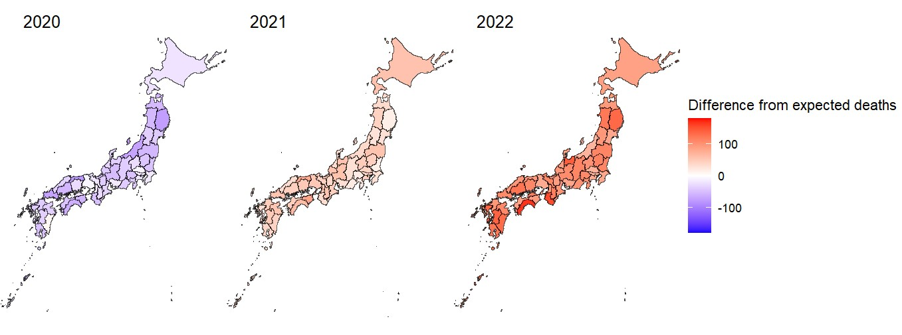
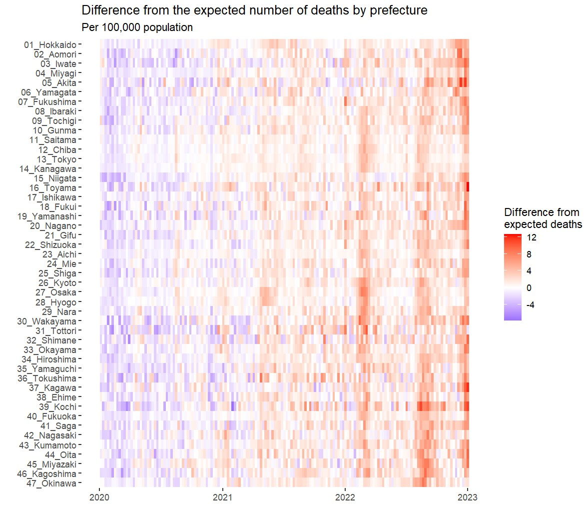

# **Japan's True COVID Toll: 135,000 Excess Deaths in Three Years**
Geospatial analysis revealed rural prefectures were hardest hit

## **Key Findings**

### **1. Japan’s true COVID toll far exceeded the official count**  
From 2020 to 2022, Japan recorded **135,000 excess deaths**, far above the **57,000 deaths officially attributed to COVID-19**.　Experts say many uncounted deaths stemmed from indirect effects — including hospital strain in urgent cases and COVID-triggered declines in frail older adults.

### **2. The worst-hit areas were rural, not urban**  
Although big cities drew attention because their raw death counts were high, deaths per 100,000 people told a different story: rural prefectures such as Kochi (Shikoku), Miyazaki (Kyushu), and Toyama (Japan Sea coast), where limited medical capacity and older populations made them especially vulnerable.

### **3. In the first year, deaths actually dropped below normal**  
In 2020, widespread mask use and the near-disappearance of seasonal flu pushed deaths below the pre-pandemic baseline, before they surged in 2021–22.

---

## **Visual Analysis: Where and When Deaths Occurred**

To uncover what nationwide death totals alone can’t show, I built:

### **• Population-adjusted choropleth maps**  
Maps of excess deaths per 100,000 people by prefecture, for each year and for the full three-year period.

### **• Weekly excess-mortality heatmaps**  
A week-by-week view of how mortality moved across all 47 prefectures.

---

## **How the Analysis Was Done**

### **Building on Mortality Baselines developed by a research team working with the Ministry**

The analysis built on weekly mortality estimates from a research team affiliated with Japan's Ministry of Health, Labour and Welfare. Their statistical models predict how many people would have died in a typical year without COVID, accounting for factors like seasonal patterns and demographic trends.

The visuals became the starting point for conversations with researchers. Because the patterns were visually clear, it was possible to walk through the results together, check them against their epidemiological knowledge, and agree on what we could safely say in print.

**Key methodological decisions:**
- Used publicly available data from [exdeaths-japan.org](https://exdeaths-japan.org/en/)  
- Applied the central estimate of the research team's uncertainty ranges as a conservative central value  
- Validated the approach through discussions with the modelers about how to communicate uncertainty honestly while remaining accessible  

This grounding in government-affiliated research gave the analysis credibility while maintaining editorial independence.

---

## What I Contributed

- Led the **data analysis and visualization**, building a reproducible R pipeline for weekly excess mortality and per-capita prefectural comparisons.
- Worked closely with researchers to interpret model uncertainty and communicate its limitations clearly to editors.  
- Coordinated with medical reporters covering rural hospitals, ensuring our quantitative findings aligned with what frontline physicians were seeing — strengthening the accuracy and credibility of the story.
- Iterated on maps and heatmaps with editors and designers, integrating narrative needs with statistical accuracy.  
- Built the reproducible R workflow which resulted in an invitation to present the methods at a national R user group.  

---

## Links

- **"Japan Recorded 135,000 Excess Deaths in Three Years of COVID"**
  [Japanese article](https://digital.asahi.com/articles/ASR5577C0R4MUTFL015.html)
  *The Asahi Shimbun (Circulation +3 million), Page 1, May 2023*
- **"Rural Japan Suffered the Highest Excess Deaths"**
  [Japanese article](https://digital.asahi.com/articles/ASR5577GCR4PUTFL00C.html)
  *The Asahi Shimbun, Page 2, May 2023*  
- [Full analysis & code (R)](https://ryomakom.github.io/exdeaths/)

---

Ryoma Komiyama — Data Journalist  
📧 ryomakom@gmail.com
