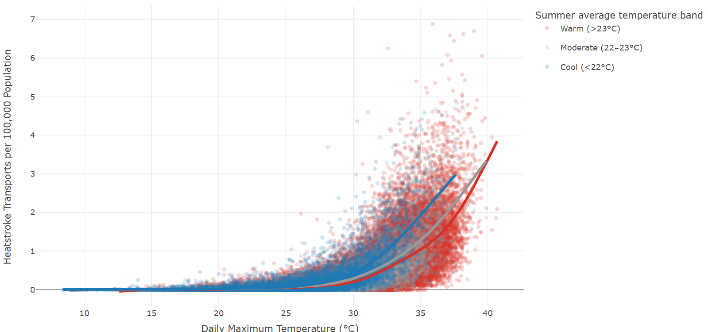

# **Why Japan's Coolest Regions Face Double the Heatstroke Risk**  
### *790,000 emergency records revealed a hidden vulnerability*

## **The Hidden Pattern**

Japan relies on a single national threshold for heat alerts. But an analysis of **790,000 emergency transports** reveals a major blind spot:

> **People living in Japan’s far-northern, typically cold regions—Hokkaido and the Tohoku prefectures (Aomori, Iwate, Akita, Miyagi)—face nearly *double* the heatstroke risk at the same temperature.**

At 35°C, these cooler northern areas record about 2 cases per 100,000 people, compared with 1 in warmer regions.  

---

## **Why This Matters**

### **For Japan**
Japan’s uniform heat-alert threshold assumes equal vulnerability nationwide. But cooler regions lack **heat acclimatization**—physiological adaptation built through repeated exposure—making residents far more susceptible.

### **Global Implications**
As extreme heat reaches places historically spared, unacclimatized populations face disproportionate risk. The same dynamic likely applies to **northern Europe**, **Canada**, and **northern U.S. states**.

---

## **Visual Highlight**
**Heatstroke Risk Is Nearly Twice as High in Japan’s Coolest Regions**

***Cool areas show almost 2× the heatstroke incidence of warm regions at the same temperature.***

<iframe src="hs_risk_chart.html" width="100%" height="500" 
        style="border:none;" loading="lazy">
  
</iframe>

  <a href="hs_risk_chart.html" target="_blank">View interactive version</a> | 
  <a href="images/heatstroke-risk-curves.png">Static image</a>

---

## **How the Analysis Worked**

### **Data Sources**
- 790,000+ heatstroke emergency transports (2008–2022, Japan's Fire and Disaster Management Agency)  
- Daily temperature and humidity from 47 prefectural capitals  
- Population data for per-capita normalization  

### **Climate Grouping**
Prefectures classified by typical summer climate (mean May–Sept temperature):
- **Cool:** ≤22°C (Hokkaido, northern Tohoku)  
- **Moderate:** 22–23°C  
- **Warm:** ≥23°C (Kyushu, Shikoku, southern Honshu)

### **Statistical Approach**
We ran regression models to test which factors best predict heatstroke transports—comparing climate differences, population aging, air-conditioner ownership, and other regional variables—while flexibly modeling the nonlinear relationship between temperature and risk.

---

## **A Collaborative Validation Process**

Because I'm a data specialist—not a climate or medical expert—rigorous validation was essential.

### **Climate Reporting**
Worked with Asahi’s climate reporters to identify meaningful variables and frame the heat-acclimatization hypothesis.

### **Epidemiological Review**
Reviewed all major findings (plots, models, anomalies) with a university epidemiologist, asking: *Is this physiologically plausible? Could this be a modeling artifact?*

### **Confirmation**
The pattern aligned with heat-acclimatization science, supporting the decision to center the story on regional vulnerability.

This multi-stage validation ensured the investigation was both statistically rigorous and clinically meaningful.

---

## Links

- **"The cooler the region, the greater the risk of heatstroke"**
  [Japanese article](https://digital.asahi.com/articles/ASR6V5TRJR6FULBH00D.html)
 *The Asahi Shimbun (Circulation +3 million), Page 1, June 2023*  
- [Full analysis & code (R)](https://ryomakom.github.io/heat_stroke/)

---

Ryoma Komiyama — Data Journalist  
📧 ryomakom@gmail.com
