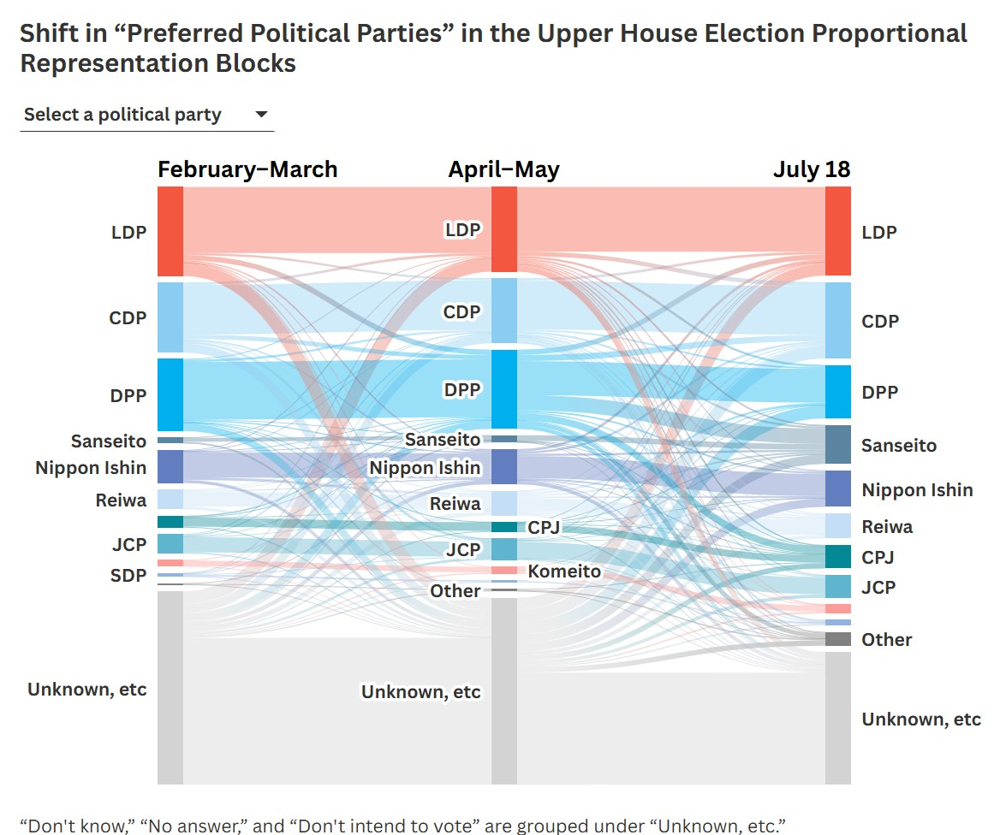

# How Japan's First Major Populist Party Found Its Voters: A 10-Wave Survey Tracking 5,200 People

### *with Prof. Asako Miura (The University of Osaka)*

---

## What This Project Achieved
In 2025, ahead of the July Upper House election, I co-led a series of high-frequency surveys that tracked 5,200 individuals across 10 waves (19,000 total responses).

This rare design — especially unusual for a news organization — allowed us to see something typically invisible: how the same individuals changed their political preferences over time.

One finding stood out: roughly half of Sanseito’s rapid pre-election growth came from former Democratic People’s Party (DPP) supporters —  **a shift from a mainstream opposition party to a new right-leaning populist force.**

### Visualizing the Voter Flow
The Sankey diagram makes the voter movement visible at an individual level — something traditional polling cannot capture.

(The chart analyzes the 1,200 respondents who participated in the three key survey waves used to track movement.)

  

      
      <noscript>
          
      </noscript>
  

This was likely the first media investigation in Japan to track individual-level voter movement in real time during a national election.

---

### What This Finding Means

The data revealed that the DPP — a mainstream opposition party — had been quietly functioning as a **buffer** for voters uneasy with existing political options. On the surface these supporters looked conventional, but their underlying attitudes—low institutional trust, heavy reliance on social media, and openness to anti-establishment messages—set them apart from traditional party bases.

When the DPP stumbled in its candidate selection for the 2025 Upper House race, that buffer collapsed. As the July 20 election approached, these voters shifted rapidly to Sanseito — a new right-leaning populist party that spoke directly to their concerns.

The result was decisive: Sanseito won 14 seats and gained enough influence to shape the ruling coalition’s direction.

---

## The Distinct Profile of Emerging-Party Supporters

Across the 10 waves, a consistent profile became clear among supporters of emerging parties such as Sanseito:  
- **Low trust in institutions**    
- **Heavy reliance on YouTube** and other social media for political information  
- **Fandom-style political engagement** (strong loyalty + hostility toward opponents)  
- **Higher openness to conspiracy-leaning narratives**

These traits were also visible — though more weakly — among many DPP supporters.

---

## Why This Matters Globally

Japan is often seen as resistant to right-wing populism — in part because its foreign-born population share is not as high as in other countries — yet the patterns we observed closely mirror developments seen elsewhere:  
- **Institutional distrust** driving voters toward outsider parties (as in the U.S. 2016 shift).  
- **Digital-media ecosystems** enabling rapid mobilization, similar to trends in Europe.  
- **Collapse of a “buffer” party** releasing disaffected voters.

---

## How the Survey Was Conducted
The survey was administered online, with about 5,200 respondents followed across 10 waves.

- Questionnaire design was led entirely by Prof. Asako Miura, a social psychologist with deep expertise in political behavior.  
- I received the raw, wave-by-wave datasets and performed independent cleaning and statistical analysis using R.  
- All interpretations were cross-checked with Prof. Miura before publication to ensure neutrality and accuracy.

This workflow provided transparency, academic oversight, and methodological consistency.

---
## What I Contributed

**Data Work & Analysis**
- Built a fully reproducible R pipeline to clean and analyze all 10 survey waves (tidyverse, R Markdown).  
- Quantified individual-level voter flows and examined the links between media use, trust, and party preference.

**Storytelling & Visualization**
- Developed public-facing interactive graphics (Flourish) and internal visualizations (ggplot2, plotly).  
- Wrote the full 9-article investigative series, translating complex statistical findings into accessible narratives.

---

## Links

### Article Series (“ネット意識と選挙” / *Online Sentiment and Elections*)
Key articles from [9-part series on The Asahi Shimbun](https://www.asahi.com/rensai/list.html?id=920) (circulation +3 million)
- [Mass voter shift from the DPP to Sanseito](https://digital.asahi.com/articles/AST7M4HRFT7MULLI001M.html)
- [Political fandom and social-media dependence](https://digital.asahi.com/articles/AST6Z3DV0T6ZULLI008M.html)
- [Institutional distrust among new-party supporters]( https://digital.asahi.com/articles/AST791F8TT79ULLI009M.html)

### Open Data
[Survey dataset by Prof. Miura & The Asahi](https://sites.google.com/view/the-uosaka-asahi-survey/)

---

Ryoma Komiyama — Data Journalist  
📧 Email: ryomakom@gmail.com
