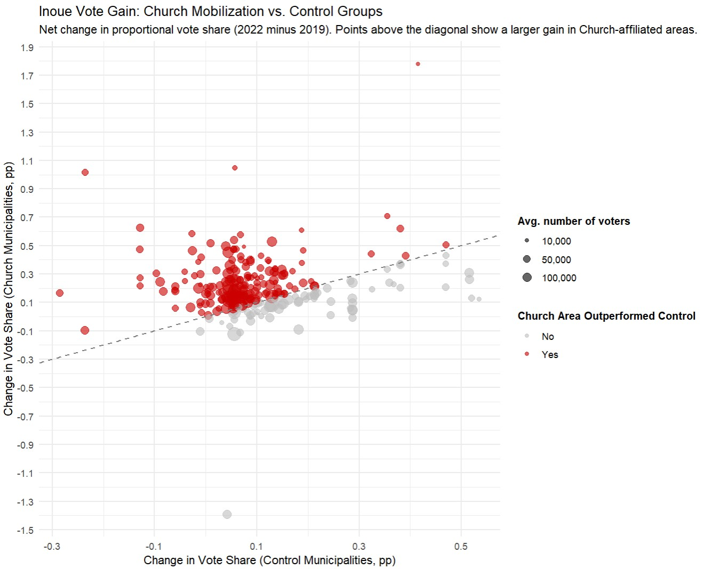

# How a Religious Organization Delivered Decisive Votes in a National Election — A Reproducible Causal Estimate from Japan

**Question:**  
Can a religious organization mobilize enough votes to sway a national election?

For years, some politicians within Japan’s ruling party — including allies of former Prime Minister Shinzo Abe — maintained ties with the Family Federation for World Peace and Unification (the former Unification Church), a group widely criticized as a cult that pressured followers into large, coercive donations. After Abe’s assassination in 2022, a question surfaced: **Was the Church useful enough that some politicians stayed close to it—even when the reputational costs were obvious?**

This project offers what appears to be the first quantitative estimate of that electoral impact.

---

## Research Design

This rare quasi-experimental case allows causal inference:  
**Yoshiyuki Inoue — a former executive secretary to Abe —** ran two national proportional-representation campaigns only three years apart.

### Support from the Church (Analytical Assumption)

Because proportional races report vote totals for ~1,900 municipalities, we can measure changes from 2019 → 2022 with high precision.  
**259 of those municipalities host a Church facility**, where the organization’s activities — and thus its electoral mobilization — are believed to be more active.

| Election | Municipality without Facility | Municipality with Facility |
|----------|-------------------------------|----------------------------|
| **2019** | × No support                  | × No support               |
| **2022** | ? Possible support            | ○ Likely support           |

To estimate the Church’s effect, each facility municipality was matched with a statistically similar non-facility municipality across 100+ demographic variables. In plain terms: I compared pairs of places that look nearly identical on every observable characteristic — except that only one had a Church facility — so the difference in their vote shifts can be interpreted as the Church’s effect.

---

## Key Findings

| Effect                                              | Size                         |
|-----------------------------------------------------|------------------------------|
| Increase in vote share in municipalities with a Church facility | **≈ +0.07 percentage points** |
| Nationwide vote contribution attributable to the Church | **≈ 17,000 votes**              |

- Because they include only municipalities with a Church facility, **17,000 votes is a conservative lower bound**.  
- **17,000 votes ≈ 20% of Inoue’s entire 2019 vote total**, indicating substantial mobilization power relative to his baseline support.
- Results are highly consistent across matching specifications.

The impact was real: Inoue lost in 2019 but won in 2022 — and the magnitude of the Church’s mobilization helps explain how the outcome flipped within a single campaign cycle.

---

## Visual Summary

---

## Reproducibility & Skills Demonstrated

All data collection, cleaning, statistical modeling, matching, visualization, and reporting were conducted by the author, with methodological advice from academic researchers.

- Full reproducible R pipeline: data collection, cleaning, matching (nearest-neighbor + genetic), uncertainty estimation, and visualization
- Causal inference translated into accessible journalism for a general audience
- Transparent communication of assumptions and limitations

**Publication history:**

- A preliminary version of the findings appeared as a news investigation in the *Asahi Shimbun*.  
- The research was later expanded using full causal-inference methods and published in *The Journal of Electoral Studies (選挙研究)*.  
  *Because of the journal’s publishing policy, online release will take about three years after print publication; the article is available upon request.*  
- The project drew professional recognition, leading to invitations to present the methodology at a cross-newsroom investigative-reporting workshop and to brief a lawyers’ association supporting victims of the former Unification Church.

---

## Links

- **"LDP's Inoue sees increased votes In a municipality with Church Facilities"**
  [Japanese article](https://digital.asahi.com/articles/ASQ8K7VY0Q8CULEI001.html)
  *The Asahi Shimbun (Circulation +3 million), Page 2, August 2022*  
- [Full analysis & code (R)](https://ryomakom.github.io/UC_inoue2/)  
- [R Markdown report (Japanese)](https://github.com/ryomakom/UC_inoue2)  

---

Ryoma Komiyama — Data Journalist  
📧 Email: ryomakom@gmail.com
